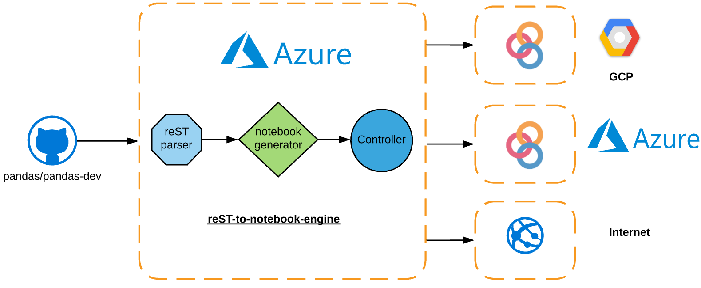

# prebinder
A workflow engine to create runnable documentation<

## About 
`prebind` is a workflow engine and controller that is powered by Azure for creating runnable documentation. 

## Current architecture

## Workflow engine 

## Output of `prebinder`
* Getting Started with pandas in 10 minutes
    * [Azure](https://prebinders-iamshreeram.notebooks.azure.com/j/notebooks/10min.ipynb)
    * [Binder](https://hub-binder.mybinder.ovh/user/iamshreeram-pandas-binder-s2i014jv/notebooks/build/jupyter/getting_started/10min.ipynb)